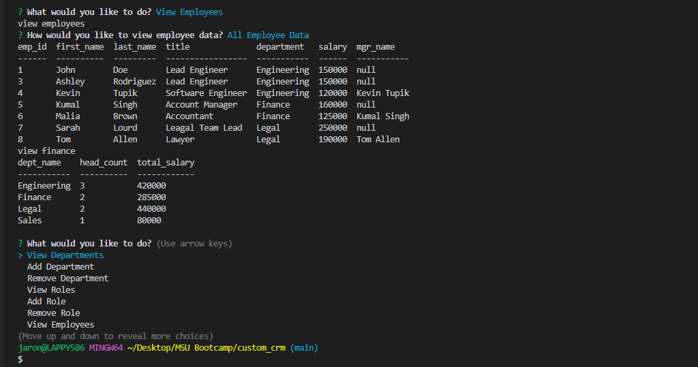

# Custom CMS (Content Management System)

### Description
This app allows the user to manage their employee records via the command line

The Functions are as follows:
1. Add/Remove Departments
2. Add/Remove Roles and Associated Salaries
3. Add/Remove/Update Employee Records and Manager Associations
4. Reporting - There are a handful of custom reports available as well